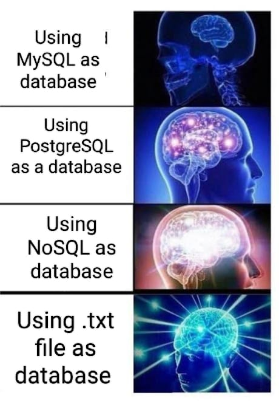

# Esspress
### Web server using C programming language!

Hi!! This is just a experiment purpose build!!

This semester i have course Software Development Course. Where i have to build a project with C programming. But catch is i have to use .txt file as database. 

Since I can't use any modern database i tried to build one with .txt file! While building that project I was thinking if i can build a Web server with C  but database is just a single text file. How it would be?

So just built this; by learning socket programming.

### Documentation

It's a simple project it only capable of running in a port and use `/GET` request.

To run this locally- 

Step 1: ``git clone git@github.com:uthsobcb/esspress.git``

Step 2: ``cd esspress``

Step 3: ``gcc http_server.c -o http_server``

Step 4: ``./http_server``

Step 5: Open Browser and go to  [localhost:8001](localhost:8001) 
TO use `/GET` request go to [/GET](localhost:8001/data)

### Contribution

This is just a fun project. If anyone willing to contribute. Welcome to do it. Maybe we can 
`POST, DELETE and PUT` request as Well.

Thanks!!